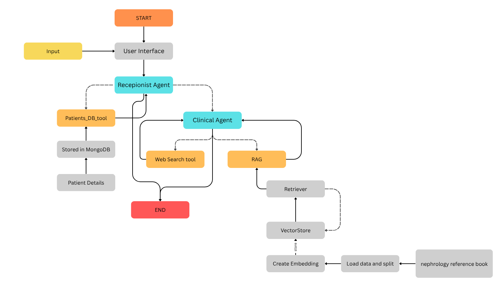

# Post-Discharge Medical AI Assistant

## Problem Overview
Patients discharged from hospitals often require ongoing support to understand their medical reports, follow care instructions, and access reliable information. Manual follow-up is resource-intensive and prone to gaps, leading to poor outcomes. This application addresses these challenges by providing an AI-powered assistant for post-discharge patient support.

## Demo Video: [Click here](https://drive.google.com/file/d/1CpdnneOs33Ay6kqqFI52I1kFOodcrOHq/view?usp=sharing)

## What is this Application?
This is an AI-powered assistant designed to help patients after hospital discharge. It can answer questions about medical reports, provide reference information, retrieve patient-specific data, and perform web searches for up-to-date medical knowledge. The system uses a multi-agent architecture, retrieval-augmented generation (RAG), and integrates with vector databases and web search tools.

## Technical Overview

### LLM Selection
- **Model:** Google Gemini 2.5 Flash
- **Purpose:** Natural language understanding and generation for medical and general queries.
- **Location:** `agents/llm_model.py`

### Vector Database
- **Model:** Qdrant (cloud-native vector DB)
- **Purpose:** Stores and retrieves document embeddings for similarity search.
- **Location:** `qdrant_data/`, `agents/clinical_agent/rag/`

### RAG Implementation
- **Technique:** Retrieval-Augmented Generation pipeline using LLM + vector search
- **Purpose:** Retrieves relevant context from vector DB and augments LLM responses.
- **Location:** `agents/clinical_agent/rag/create_vectorstore.py`, `agents/clinical_agent/rag/load_vectorstore.py`

### Multi-Agent Framework
- ### Agent Techniques and Orchestration
- **LangGraph:** Used for building modular, multi-agent workflows. Enables graph-based agent orchestration, state management, and flexible workflow design.
- **create_swarm:** Utility from LangGraph Swarm to easily create a multi-agent system. Allows specifying multiple agents (e.g., Receptionist, Clinical) and setting a default active agent. Handles agent orchestration and workflow compilation.
- **handoff_role (create_handoff_tool):** Enables smooth handoff of conversation or tasks between agents. Used when one agent (e.g., Receptionist) detects a query that should be handled by another agent (e.g., Clinical). Ensures the right agent responds to the right type of query.
- **ReAct Agent (Reason + Act):** Implements the ReAct (Reason + Act) paradigm for agents. Agents can reason about the query, decide on actions (e.g., retrieval, web search), and generate responses. Supports tool use, memory, and multi-step reasoning.

These techniques together enable a flexible, modular, and intelligent multi-agent system for your medical AI assistant, allowing for dynamic handoff, context-aware responses, and robust workflow management.

- **Purpose:** Task-specific agents for patient interaction and clinical Q&A.
- **Location:** `agents/receptionist_agent/receptionist_agent.py`, `agents/clinical_agent/clinical_agent.py`, `agents/graph_builder.py`, `agents/receptionist_agent/`, `agents/clinical_agent/`

### Web Search Integration
- **Tool:** Custom web search tool (e.g., DuckDuckGo via LangChain)
- **Purpose:** Fallback to fetch latest medical info from the web.
- **Location:** `agents/clinical_agent/rag/tools/web_search_tool.py`

### Patient Data Retrieval
- **Storage:** MongoDB or JSON-based storage, custom access layer
- **Purpose:** Secure retrieval and summarization of patient-specific data.
- **Location:** `backend/mongo_database.py`, `backend/logger.py`, `data/patient_reports.json`


## POC Architecture

The Proof-of-Concept (POC) architecture for the Post-Discharge Medical AI Assistant demonstrates a modular, multi-agent system for patient support. 

The architecture includes:

- **Frontend:** Streamlit web application for user interaction.
- **Backend:** FastAPI (optional) for API endpoints and business logic.
- **Agents:** Modular agents (Receptionist, Clinical) for handling different types of queries.
- **RAG Pipeline:** Retrieval-Augmented Generation using Qdrant vector database and LLM for context-aware responses.
- **Vector Database:** Qdrant for storing and retrieving document embeddings.
- **Patient Data Storage:** MongoDB or JSON for patient-specific data.
- **Web Search Integration:** Custom tool for fetching up-to-date medical information from the web.
- **Logging:** Centralized logging for tracking interactions and retrievals.

### High-Level Workflow

1. **User Interaction:**
   - User submits a query via the Streamlit app.
2. **Receptionist Agent:**
   - Handles general queries, patient identification, and triage.
   - Forwards medical or complex queries to the Clinical Agent.
3. **Clinical Agent:**
   - Uses RAG pipeline to retrieve relevant information from the vector database and reference materials.
   - Can access patient data and perform web searches if needed.
4. **Response Generation:**
   - LLM generates a context-aware response, which is returned to the user.
5. **Logging:**
   - All interactions and retrieval attempts are logged for traceability.

---

## Application Workflow

- The application starts with the Receptionist Agent, which acts as the first point of contact for users.
- If the query is general or administrative, the Receptionist Agent handles it directly.
- If the query is clinical or requires medical expertise, the workflow hands off to the Clinical Agent.
- The Clinical Agent uses the RAG pipeline to search the vector database (Qdrant) for relevant medical information, combines it with patient data from MongoDB/JSON, and can also perform web searches for the latest information.
- The final response is generated using the LLM and returned to the user through the Streamlit interface.

---

## Project Structure

```text
app/
    main.py                        # Streamlit UI entry point
    main_api.py                    # FastAPI backend (optional)

agents/
    graph_builder.py               # LangGraph workflow setup
    llm_model.py                   # LLM API integration
    clinical_agent/
        __init__.py
        clinical_agent.py          # Clinical agent logic
        rag/
            create_vectorstore.py      # Build vector DB
            load_vectorstore.py        # Load/query vector DB
            tools/
                rag_tool.py            # RAG utilities
                web_search_tool.py     # Web search tool
    receptionist_agent/
        receptionist_agent.py      # Receptionist agent logic
        load_reports.py            # Load patient reports
        patient_report_tool.py     # Patient report utilities

backend/
    mongo_database.py              # MongoDB access
    logger.py                      # Logging

data/
    patient_reports.json           # Dummy reports
    nephrology_reference.pdf       # Reference material

qdrant_data/                       # Qdrant vector DB data
logs/                              # Log files
requirements.txt                   # Python dependencies
README.md                          # Project documentation
```

## How to Run

Before starting the Streamlit application, you must:

1. **Install virtual environment**
    ```powershell
   python -m venv venv
   ```

1. **Install dependencies:**
   ```powershell
   pip install -r requirements.txt
   ```
2. ** Start with Docker:**
   ```powershell
   docker run -p 6333:6333 qdrant/qdrant
   ```
3. **Load patient data into MongoDB:**
   Run the following command to add patients to the database:
   ```powershell
   python agents/receptionist_agent/load_reports.py
   ```
4. **Create and store PDF vectors in Qdrant:**
   Run the following command to process the reference PDF and store its vectors:
   ```powershell
   python agents/clinical_agent/rag/create_vectorstore.py
   ```

5. **Run the Streamlit app:**
   ```powershell
   streamlit run app/main.py
   ```
6. **Access the app:**
   Open your browser and go to [http://localhost:8501](http://localhost:8501)

---

## Notes
- Ensure MongoDB and Qdrant are running locally or update connection URIs as needed.
- The `.streamlit/secrets.toml` file should contain your Google API key for Gemini: `GOOGLE_API_KEY=...`
- For development, logs are saved in the `logs/` directory.
- For API usage, you can run the FastAPI backend with:
  ```powershell
  uvicorn app.main_api:fastapi_app --reload
  ```

## License
This project is for educational and research purposes only. Not for clinical use.


